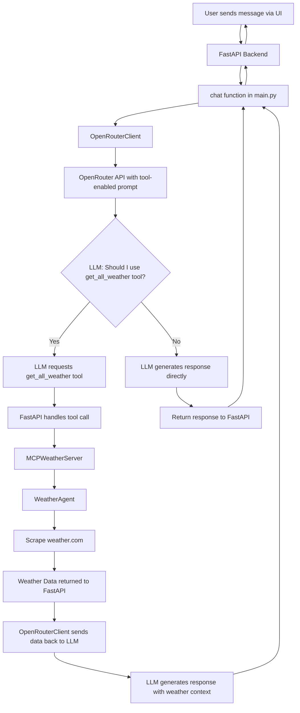

# 🌤️ Weather LLM Demo

A simple demo of a weather aware LLM powered chatbot using a weather agent.

## Quick Start

This guide will get you up and running in a few minutes.

### Prerequisites

1.  **OpenRouter API Key**: You need an API key from [OpenRouter](https://openrouter.ai/).
2.  **UV**: You need `uv`, the Python package installer. If you don't have it, install it:
    ```bash
    # On macOS/Linux
    curl -LsSf https://astral.sh/uv/install.sh | sh
    ```

### 1. Setup your API Key

Create a file named `.openrouter_api_key` and paste your key into it.

```bash
echo "your-openrouter-api-key" > .openrouter_api_key
```
*Note: For a quick test without a real key, you can use `"demo_key"`.*

### 2. Install Dependencies

This command uses `uv` to install all the necessary Python packages defined in `pyproject.toml`.

```bash
make install
```

### 3. Run the Demo

This command will start the web server on `http://127.0.0.1:8000`.

```bash
make run
```

Open your browser to [http://127.0.0.1:8000](http://127.0.0.1:8000) to see the demo. For development with auto-reload, use `make dev`.

---

## Available Commands

### Using Make (Recommended)

```bash
make install    # Install/sync dependencies
make run        # Run the application
make dev        # Run with auto-reload
make test       # Run tests
make clean      # Clean temporary files
make docker-build  # Build Docker image
make docker-run    # Run with Docker
```

### Using UV Directly

```bash
# Install dependencies
uv sync

# Run application
uv run python src/weather_llm_demo/main.py

# Run with uvicorn (development)
uv run uvicorn src.weather_llm_demo.main:app --reload

# Add a new dependency
uv add package-name

# Remove a dependency
uv remove package-name

# Update dependencies
uv sync --upgrade
```

## Docker Deployment

### Build and Run

```bash
# Using docker-compose
docker-compose up --build

# Or using Make
make docker-build
make docker-run
```

## Project Structure

```
weather-llm-demo/
├── pyproject.toml       # UV/Python project configuration
├── uv.lock             # Locked dependencies (auto-generated)
├── .python-version     # Python version for UV
├── src/weather_llm_demo/main.py # FastAPI application
├── src/weather_llm_demo/weather_agent.py # Weather data scraper
├── src/weather_llm_demo/mcp_server.py    # MCP protocol implementation
├── src/weather_llm_demo/openrouter_client.py # OpenRouter API client
├── index.html          # Web interface
├── scripts/run_uv.sh   # UV run script
├── scripts/dev_uv.sh   # Development run script
├── Makefile           # Convenience commands
└── .openrouter_api_key # API key (create this)
```
## Tool Calling Flow

The following diagram illustrates the tool calling process that fetches weather data and generates a response.


|
### File and Line Number References
|
- **FastAPI Chat Endpoint**: The process starts at the `/api/chat` endpoint in [`src/weather_llm_demo/main.py:145`](src/weather_llm_demo/main.py:145).
- **MCP Tool Call**: The `chat` function calls the `handle_tool_call` method in [`src/weather_llm_demo/mcp_server.py:34`](src/weather_llm_demo/mcp_server.py:34).
- **Weather Agent**: The `MCPWeatherServer` uses the `WeatherAgent` to fetch data in [`src/weather_llm_demo/weather_agent.py`](src/weather_llm_demo/weather_agent.py).
- **OpenRouter Client**: The final response is generated by the `create_completion` method in [`src/weather_llm_demo/openrouter_client.py:23`](src/weather_llm_demo/openrouter_client.py:23).


## Troubleshooting

### UV not found
```bash
curl -LsSf https://astral.sh/uv/install.sh | sh
```

### Dependencies not installing
```bash
# Clean and reinstall
rm -rf .venv uv.lock
make install
```

### Port already in use
```bash
# Kill process on port 8000
lsof -ti:8000 | xargs kill -9
```

## Development Workflow

1.  **Add dependencies**:
    ```bash
    uv add fastapi uvicorn
    ```

2.  **Add dev dependencies**:
    ```bash
    uv add --dev pytest black ruff
    ```

3.  **Update all dependencies**:
    ```bash
    uv sync --upgrade
    ```

4.  **Run tests**:
    ```bash
    uv run pytest
    ```

5.  **Format code**:
    ```bash
    uv run black .
    uv run ruff check .
    ```

## Configuration

This project uses a combination of a dedicated API key file for secrets and a `.env` file for non-secret configuration.

### API Key (Secret)

The OpenRouter API key is considered a secret and **must** be stored in a file named `.openrouter_api_key` in the root of the project. This file is listed in `.gitignore` to prevent accidental commits.

```bash
echo "your-openrouter-api-key" > .openrouter_api_key
```

### Environment Variables (`.env` file)

For non-secret configuration, you can create a `.env` file in the project root. An example is provided in `.env.example`.

```env
# .env

# -- Server Configuration --
# Host and port for the web server.
HOST=0.0.0.0
PORT=8000

# -- Weather Station --
# Find your station ID on a weather service like Weather Underground.
STATION_ID=IROME8278
LOCATION="Rome, Italy"

# -- LLM Configuration --
# Specifies the model to use from OpenRouter for tool-calling.
# See https://openrouter.ai/docs#models for available models.
TOOL_CALLING_OPENROUTER_LLM_MODEL=qwen/qwen3-14b
```

**Variable Roles:**

*   `HOST`: The IP address the server will listen on. `0.0.0.0` makes it accessible on your local network.
*   `PORT`: The port the server will run on.
*   `STATION_ID`: The unique identifier for the weather station to pull data from.
*   `LOCATION`: A human-readable name for the location, used for display purposes.
*   `TOOL_CALLING_OPENROUTER_LLM_MODEL`: The specific language model that will be used for generating weather-aware responses.

## API Endpoints

- `GET /` - Web interface
- `GET /api/weather/current` - Current conditions
- `GET /api/weather/forecast` - Weather forecast
- `POST /api/chat` - Chat with assistant
- `GET /docs` - API documentation

---
